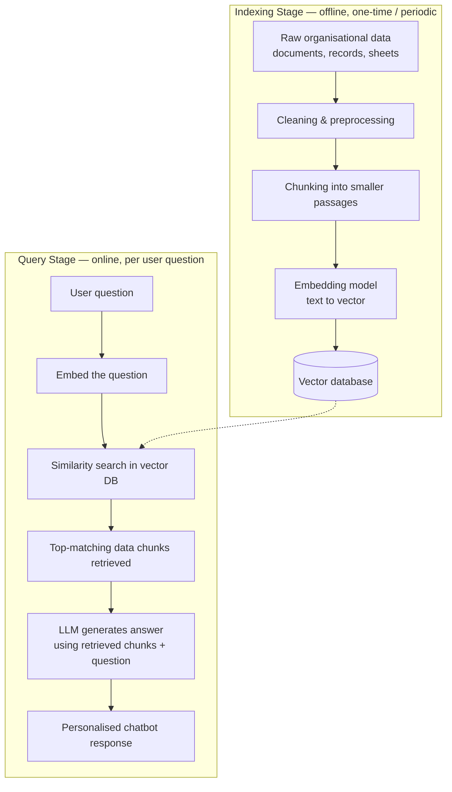
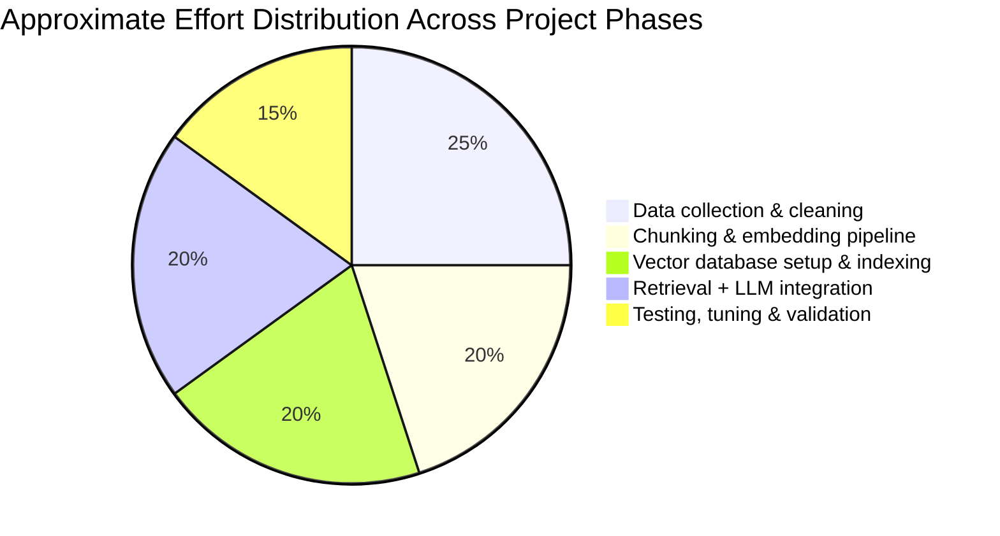

# Internship Report

## On

**Partnering with AI in the Workplace**
*(A Forage Job Simulation with Datacom)*

**Submitted To**
School of Computer Science and Engineering
IILM University, Greater Noida, U.P.

*In partial fulfilment of the requirement of degree of*
**B.Tech CSE**

**By**
Name of Student: MOHAMMAD KASHIF SALEEM
Roll Number of Student: 2410031358
Section: 2CSE 22
Batch: 2025-26

**2026-27**

---

## Candidate's Declaration

I, Mohammad Kashif Saleem Ansari, do hereby declare that the internship report titled "Partnering with AI in the Workplace – A Job Simulation with Datacom" has been completed by me to fulfil the requirement for the award of the degree of Bachelor of Technology in Computer Science and Engineering. All the references have been quoted and I have not taken as such any material from any other source. I affirm that this report is my own work and has not been submitted to any other institute for any degree/diploma requirement, and I shall be solely responsible for any kind of copyright violation in this regard.

Signature: Kashif Saleem
Student Name: Mohammad Kashif Saleem Ansari
Roll No.: 2410031358

---

## Acknowledgement

I am using this opportunity to express my gratitude to everyone who supported me throughout this internship / job simulation program. I am thankful for their aspiring guidance, invaluably constructive feedback and friendly advice extended to me during the course of this work.

I would like to sincerely thank the faculty of the School of Computer Science and Engineering, IILM University, Greater Noida, for their continuous support and encouragement, and Forage and Datacom for designing and providing the "Partnering with AI in the Workplace" job simulation, which gave me a practical, hands-on understanding of how AI tools are used in a real workplace setting.

I express my gratitude to my parents for their blessings and constant encouragement.

Signature: Kashif Saleem
Student Name: Mohammad Kashif Saleem Ansari
Roll No.: 2410031358

---

## Internship Completion Certificate

Certificate of Completion issued by Forage on behalf of Datacom to **kashif saleem**, dated **August 31st, 2026**, for the "Partnering with AI in the Workplace Job Simulation," confirming completion of the following practical tasks:

- Writing effective prompts
- Partnering with AI to research, design and create
- Click, prompt, fix: first steps into AI-powered debugging

Signed by Tom Brunskill, Co-Founder of Forage.
Enrolment Verification Code: `6a9507242b27748900a0276d`
User Verification Code: `6a9506ad975682cf622b56cd`

*(See the attached certificate image / the .docx version of this report for the visual certificate.)*

---

## Table of Contents

| Chapter | Section | Page |
|---|---|---|
| | Cover Page | ---- |
| 1. | Candidate's Declaration | i |
| 2. | Acknowledgement | ii |
| 3. | Internship Completion Certificate | iii |
| 4. | Project Description | 1 |
| 5. | Bibliography / References | 7 |

---

# 4. Project Description

## 4.1 Introduction

This report presents the work completed during a virtual job-simulation internship, "Partnering with AI in the Workplace," undertaken through the Forage platform in partnership with Datacom. The simulation was designed to give participants practical exposure to how professionals in a modern technology organisation collaborate with AI systems as part of their everyday workflow. Rather than a traditional on-site placement, the internship followed an industry-designed, task-based virtual format in which real workplace scenarios were simulated so that the intern could practise applied skills under realistic constraints, at a pace and depth that mirrors what a graduate hire at Datacom would encounter in their first weeks on the job.

The rapid adoption of generative AI across the software industry has changed the nature of entry-level technical work. Tasks that once required hours of manual research, drafting or line-by-line debugging can now be accelerated significantly with an AI assistant — provided the person directing that assistant knows how to ask the right questions, verify the answers, and catch the mistakes AI systems still make. This internship was built around exactly that premise, and it gave me a structured, low-risk environment in which to build and demonstrate this skill set.

Over the course of the program, the internship focused on three practical skill areas: writing effective prompts for AI systems, partnering with AI to research, design and create work products, and using AI as a collaborator in debugging code. This report documents the organisation, the problem context, the objectives and scope of the simulation, the tools and methodology used, the outcomes achieved, and the certificate of completion issued on successful conclusion of the program. Each of the following sections corresponds to one aspect of the internship experience and, together, they form a complete record of the work undertaken.

## 4.2 Organization Profile

Datacom is a technology services and IT solutions company headquartered in New Zealand and operating extensively across Australia and New Zealand, and more broadly across the Asia-Pacific region. It provides a wide range of services including IT operations and managed services, cloud infrastructure and migration, cybersecurity, custom application development, data and analytics, and business process outsourcing, serving government departments, healthcare providers, telecommunications companies and large enterprise clients.

As part of its outreach to early-career talent, Datacom partnered with Forage — a platform that hosts free, virtual, industry-designed job simulations used by millions of students worldwide — to create the "Partnering with AI in the Workplace" simulation. Forage simulations are built in collaboration with the partner company's own engineers and people teams, so that the tasks reflect genuine day-to-day responsibilities rather than generic exercises.

Forage itself replicates the tasks an entry-level employee would encounter on the job, allowing students to build practical, resume-worthy skills and experience a company's real working style before ever applying for a role. Each simulation is self-paced, task-based and assessed automatically against a rubric, with written feedback provided after every submission. The simulation used for this internship was issued and verified by Forage on behalf of Datacom, with a certificate of completion awarded to me on 31 August 2026.

## 4.3 Problem Statement

Modern workplaces increasingly rely on AI tools to accelerate research, content creation, design and software debugging. However, many early-career professionals lack structured experience in prompting AI effectively, verifying and refining AI-generated output, and using AI safely and responsibly as a collaborator rather than a replacement for their own judgement. Left unguided, a new employee may either avoid AI tools altogether — losing out on real productivity gains — or over-trust AI output without checking it, which can introduce factual errors, insecure code or biased content into real work.

The simulation addressed this gap directly by placing the intern in realistic Datacom workplace scenarios that required deciding when and how to use AI, how to phrase requests to get useful and relevant results, and how to catch and correct AI mistakes — particularly in a debugging context where an incorrect fix can silently introduce a new bug. The underlying problem, in short, was: how does a new team member develop reliable, professional judgement about working alongside an AI assistant, rather than either avoiding it or blindly trusting it?

## 4.4 Project Objectives

The internship was structured around the following learning objectives, each mapped to one or more of the three task modules described in Section 4.8:

- To understand the principles of writing clear, specific and context-rich prompts that produce reliable, usable AI output on the first or second attempt.
- To practise partnering with AI tools to research a topic, structure findings, design an approach, and create a finished, professional work product.
- To learn a structured approach to AI-assisted debugging — using AI to help identify, explain and fix errors in code without introducing new ones.
- To develop judgement about when AI output can be trusted directly and when it needs to be independently verified, fact-checked or corrected.
- To practise iterating on a prompt when the first AI response is incomplete, inaccurate or off-target, rather than accepting the first draft.
- To gain simulated, real-world exposure to how a technology organisation such as Datacom expects its employees to integrate AI into everyday work responsibly.

## 4.5 Scope of the Project

The scope of this internship was limited to the three task modules provided within the Forage "Partnering with AI in the Workplace" simulation: prompt engineering practice, an AI-assisted research-and-creation task, and an AI-assisted debugging exercise. The simulation did not involve access to Datacom's live production systems, clients or confidential data; all scenarios were self-contained, sandboxed exercises designed to mirror realistic workplace situations while keeping any real company data completely out of scope.

Within this boundary, the work covered the full lifecycle of an AI-assisted task — from receiving a brief, to drafting and refining prompts, to producing a final deliverable and having it assessed — rather than any single isolated skill. What was explicitly out of scope was building or deploying any production software, integrating with Datacom's actual internal tools, or working with any live client project. The learnings from this scope, however, are broadly applicable to any software or knowledge-work environment where AI tools are used, which is the primary intent behind Forage's simulation design.

## 4.6 Technologies and Tools Used

- AI chat / large language model assistants — used for prompting, research, drafting and content generation across all three modules.
- AI-assisted code review and debugging tools — used to analyse faulty code, surface likely causes of failure, and suggest fixes.
- The Forage simulation platform — used for task delivery, brief documents, submission of deliverables, and rubric-based feedback.
- Standard productivity and documentation tools (word processor, browser, notes) — used to draft, revise and organise task submissions before they were finalised.

No specialised programming framework, database or deployment infrastructure was required, since the simulation is intentionally tool-agnostic — its focus is on the thinking process behind effective AI collaboration rather than on any one specific product.

## 4.7 System Architecture

As a job simulation rather than a software build, this internship did not involve designing or deploying a technical system in the traditional sense. Instead, the underlying "architecture" of the work was the interaction loop between the intern and the AI assistant, repeated across all three modules:

1. **Task Brief** – the simulation issued a realistic Datacom workplace scenario and a clear deliverable requirement.
2. **Prompt Composition** – the intern translated the brief into a specific, context-rich prompt for the AI assistant.
3. **AI Generation** – the AI produced a draft response, suggestion, explanation or code fix based on the prompt.
4. **Human Review** – the intern checked the AI's output for accuracy, relevance, completeness and appropriateness.
5. **Refinement** – where the output fell short, the intern revised the prompt or added missing context and re-generated.
6. **Final Submission** – the verified, polished deliverable was submitted to the Forage platform for rubric-based assessment.

This human-in-the-loop pattern — brief, prompt, generate, review, refine, submit — was repeated across all three modules and mirrors how AI is used within real Datacom project workflows, where an employee remains accountable for the accuracy and quality of anything produced with AI assistance, regardless of how much of the drafting the AI performed.

## 4.8 Methodology

The internship was completed in three sequential modules, each building on the skills developed in the one before it:

- **Module 1 – Writing Effective Prompts:** Studied prompt-writing principles such as clarity, context, constraints and iteration, then rewrote a set of vague, underspecified prompts into precise, task-appropriate prompts that specified the audience, format, tone and length expected of the output.
- **Module 2 – Partnering with AI to Research, Design and Create:** Used AI as a collaborator to research a workplace topic, structure the findings logically, and produce a polished deliverable, while independently verifying key facts and figures before finalising the output rather than accepting the AI's claims at face value.
- **Module 3 – Click, Prompt, Fix (AI-Powered Debugging):** Given a piece of faulty code, used targeted AI prompts to diagnose the bug, asked the AI to explain the root cause in plain language, evaluated the proposed fix against the original requirement, and then validated the corrected code against the expected behaviour before accepting it.

Each module's output was submitted through the Forage platform and assessed against Datacom's task rubric, with detailed written feedback returned before the next module was unlocked. This staged structure ensured that foundational prompting skills from Module 1 were actively applied and reinforced in the more complex research and debugging tasks of Modules 2 and 3, rather than being treated as an isolated, one-off exercise.

## 4.9 Expected Outcomes

On successful completion of the simulation, the following outcomes were achieved:

- The ability to write focused, context-rich prompts that reliably produce usable AI output on the first or second attempt, reducing wasted back-and-forth.
- Practical experience combining independent judgement with AI assistance in a research-and-creation task, including verifying facts the AI presented before including them in a final deliverable.
- A repeatable, four-step approach to using AI for debugging — diagnose, explain, fix, verify — that generalises well beyond the specific code sample used in the simulation.
- Greater awareness of the limits of AI assistance: recognising when an AI's confidence in an answer does not guarantee its correctness, and knowing when to fall back on manual research or testing.
- A completed, independently verifiable certificate of completion demonstrating these applied AI-collaboration skills to future employers and academic evaluators.

## 4.10 Certificates of Completion and Other Communication / Proof

The certificate of completion for this job simulation, issued by Forage on behalf of Datacom to Kashif Saleem on 31 August 2026, is attached in Chapter 3 of this report (Internship Completion Certificate). The certificate confirms that the following three practical tasks were completed: writing effective prompts; partnering with AI to research, design and create; and Click, Prompt, Fix — an introduction to AI-powered debugging.

The certificate carries an Enrolment Verification Code (`6a9507242b27748900a0276d`) and a User Verification Code (`6a9506ad975682cf622b56cd`), both of which can be used to independently verify the completion of the simulation through Forage's own verification system. This serves as the primary documentary proof of the internship referenced throughout this report.

## 4.11 Independent Project: AI-Powered Data Management Chatbot Using Vector Embeddings

### 4.11.1 Overview

Alongside the three Forage/Datacom simulation modules, I undertook a self-directed project applying the AI-collaboration skills developed during the internship to a practical data-management problem: building a personalised, retrieval-based chatbot that answers questions using an organisation's own data rather than a generic, general-purpose knowledge base. The project explored how raw, unstructured data can be transformed into a searchable "vector" representation and then used to ground an AI assistant's answers in that specific data — an approach widely known in the industry as **Retrieval-Augmented Generation (RAG)**.

### 4.11.2 Problem Addressed

A generic AI chatbot answers purely from its general training knowledge and has no awareness of an organisation's own documents, records or internal data. This project addressed that limitation by converting the target data into a machine-searchable vector form, so that the AI could retrieve the most relevant pieces of that data for any given question and use them — rather than its general knowledge alone — to compose an answer.

### 4.11.3 System Architecture

The system follows a standard two-stage RAG pattern: an offline **indexing stage**, where the source data is prepared once (and refreshed periodically), and an online **query stage**, which runs every time a user asks a question.

### 4.11.4 Tools and Technologies Used

| Layer | Purpose | Typical Tooling |
|---|---|---|
| Data preprocessing | Cleaning and chunking raw data | Python, Pandas |
| Embedding generation | Converting text chunks into vectors | Text-embedding model |
| Vector storage & search | Storing and semantically searching vectors | Vector database (e.g. FAISS, Chroma, Pinecone) |
| Orchestration | Connecting retrieval to generation | RAG orchestration framework (e.g. LangChain-style pipeline) |
| Generation | Composing the final grounded answer | Large language model (LLM) API |
| Interface | User-facing chat experience | Lightweight web/chat front-end |

### 4.11.5 Why Vector Search Instead of Keyword Search

Traditional keyword search only matches exact words, whereas a vector-based approach matches by *meaning*, so it can find relevant data even when the question is phrased differently from the source text:

| Aspect | Keyword Search | Vector (Semantic) Search |
|---|---|---|
| Matches on | Exact word overlap | Semantic similarity |
| Handles synonyms & paraphrasing | Poorly | Well |
| Best suited for | Known terms, codes, IDs | Natural-language questions |
| Role in this project | Not used alone | Core retrieval mechanism |

### 4.11.6 Project Workflow

The project followed the same "brief → build → review → refine" pattern described in Section 4.7, applied here to a data-engineering context. The approximate, indicative distribution of effort across phases is shown below:

### 4.11.7 Key Features Implemented

- An ingestion pipeline that converts raw organisational data into cleaned, chunked text ready for embedding.
- Semantic (vector) search that retrieves the most relevant data chunks for a given question, rather than relying on exact keyword matches.
- A generation layer that grounds the AI's answer in the retrieved data, reducing the chance of the chatbot inventing information not present in the source data.
- A conversational interface that lets a user ask natural-language questions and receive answers personalised to that specific dataset, instead of generic answers.

### 4.11.8 Outcomes and Learning

This project reinforced, in a practical engineering context, the same human-in-the-loop discipline emphasised throughout the internship (Section 4.7): AI-generated answers were only as reliable as the retrieval step feeding them, so retrieved chunks and generated answers were checked against the source data rather than trusted automatically. It also demonstrated a direct, applied extension of the prompt-engineering and AI-verification skills built in Modules 1–3 (Section 4.8) to a real data-management use case — showing that the same "prompt, generate, review, refine" loop used for research and debugging tasks applies equally well to building AI systems themselves.

---

# 5. Bibliography / References

1. Forage. "Partnering with AI in the Workplace – Datacom Job Simulation." Forage, 2026. https://www.theforage.com/
2. Datacom Group. "About Datacom." Datacom, 2026. https://www.datacom.com/
3. Certificate of Completion, Enrolment Verification Code 6a9507242b27748900a0276d, User Verification Code 6a9506ad975682cf622b56cd, issued by Forage, 31 August 2026.
4. Lewis, Patrick, et al. "Retrieval-Augmented Generation for Knowledge-Intensive NLP Tasks." *Advances in Neural Information Processing Systems (NeurIPS)*, 2020.
5. Pinecone. "What is a Vector Database?" Pinecone Documentation, 2026. https://www.pinecone.io/learn/vector-database/
6. LangChain. "Retrieval." LangChain Documentation, 2026. https://python.langchain.com/
